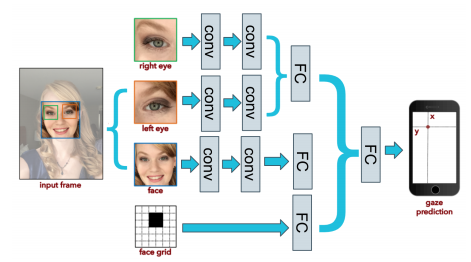

# Correcting racial biases in eye tracking
Racial biases in computer vision tasks, such as facial recognition, has been a well-documented and known problem ([Facial Recognition is Accurate, if you're a White Guy](https://www.nytimes.com/2018/02/09/technology/facial-recognition-race-artificial-intelligence.html)). In this project, I attempt to correct racial biases with MIT's GazeCapture network. One of the reasons why computer vision tasks tend to perform worse on people of color could be because the datasets lack enough people of color. Because our models don't have enough people of color to train on and have much more white people to train on, our model might just perform worse on people of color. Therefore through this project, I attempt to train our model more times on the people of color that already exist in the dataset.

## Context
Gazecapture is a prediction model where given a selfie (image) of a person looking at the screen, it predicts the x and y coordinate of where the person is looking at on the screen. This is useful for eye tracking applications and are much less expensive than state-of-art eye tracking equipment, such as using physical sensors that track the eye.

This is a diagram of the model used for my training. Given two crops of the left and right eye, a crop of the face, and a face grid, we run the images through a series of layers and calculations to produce a final x-y prediction.

## Data setup
To analyze error rates for people of color, I created subsets of the dataset. I separated out the people of color images and white people images into two sets for each training and test set. So, at the end, I had 4 sets of images: POC train, white train, POC test, and white test. HUGE DISCLAIMER: Since the original dataset gathered by MIT didn't have race as a label, I personally made the judgement whether someone was a POC or not. I only included the images I was 100$ sure whether the person is a POC or white and then I left the images I was unsure of outside of the sets. I manually went through all of the images and this process took many, many hours. The people of color took up ~30% of the dataset, so ~70% of all images were of white people.

If you are unfamiliar with machine learning, the training set is the set of images that the model directly learns from, doing computations and optimizations to improve performance on this image set. The test set is the set of images that are a representation of the "real world". Since the model has never seen the images in the test set, we can estimate the performance of our model on real, unseen data. Achieving great performance on the test set is the goal of machine learning.

## Error Analysis on Race
After learning good weights of the Gazecapture model, I ran the losses on each dataset subset. A loss is how badly our model has done, the lower the loss the better. We can think of the loss in this case as approximately how many centimeters our predicted x-y coordinate was off compared to the real x/y coordinate.

This table shows the performance of our model on each data subset:
|       | Train   | Test  |
|-------|---------|-------|
|Overall|3.43952  |3.77326|
|White  |3.36345  |2.81898|
|POC    |3.77234  |5.00844|

We can see that in the training set, the POC subset had worse performance than the white subset. And these are the images the model is trying to learn from! The white subset had a better performance than the overall dataset, meaning the model was doing really well on white people. Furthermore, if we look at the test set, the performance on POC was even worse. The POC subset had a loss of 5.00844 while the white subset had a loss of 2.81898, almost twice as worse performance. **That's crazy!**

We have successfully confirmed there is a racial bias in our data!

## Re-Training
So the question is: How do we solve this? How do we correct the racial bias in this model?

Well, let's try training more iterations on the people of the color in the training set and see if this training can generalize to the test set. So I ran a few more iterations of training, but this time only on the training POC subset of data.

These were the results after these few more iterations:
|       | Train   | Test  |
|-------|---------|-------|
|Overall|3.78119  |4.08724|
|White  |3.74180  |2.82264|
|POC    |3.31506  |4.92352|

If we look at the training set, we have successfully improved performance on the POC subset. At the same time, we have also decreased performance on the white subset as well as the overall dataset. This is because our model has started to overfit onto the POC subset. But originally, our model was overfitting on the white subset anyways so this is a worthwhile trade-off. **Ethically, even though our model might perform worse on the overall dataset, the model should perform at least equally on the people of color.** Most people might just be worried about the overall loss, but we have to perform equally (or even better: equitably) on the subsets of people we care about. More excitingly, we have also improved the performance of the test POC subset! (Even if it's just by a slight amount.) This is great sign because this is a start to correcting racial biases within our networks!

## Future Work
There are two more things I want to do with this project:
1. Find other ways to improve loss on POC: data augmentation on POC images to "create" more images of POC.

2. Gather more training images of people of color and re-train our model with new samples. If the whole problem in the first place is that people of color are lacking in the dataset, then adding more people of color into the dataset *should* fix the problem. The hope here is that our dataset will be more even and our model will learn to perform well on both white people and people of color. This approach tends to be more expensive because gathering more training data is the hard part of machine learning. So, this project tries to solve this problem without gathering more data.
